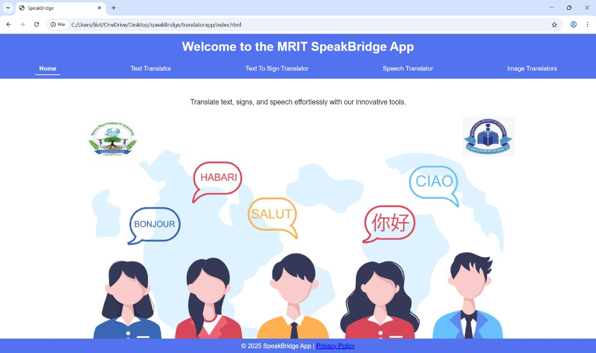
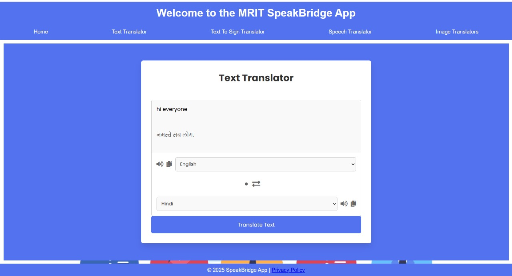
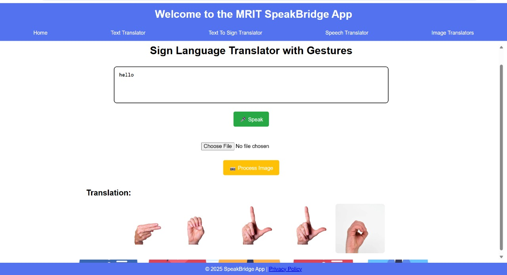
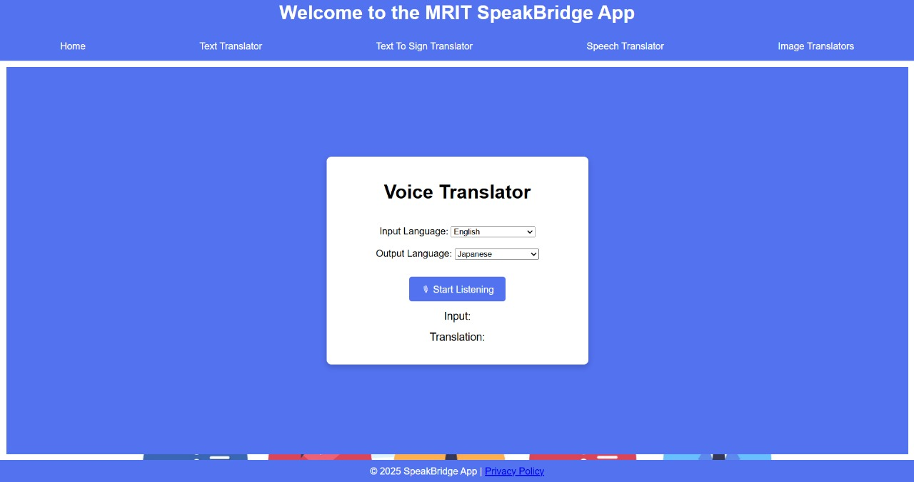
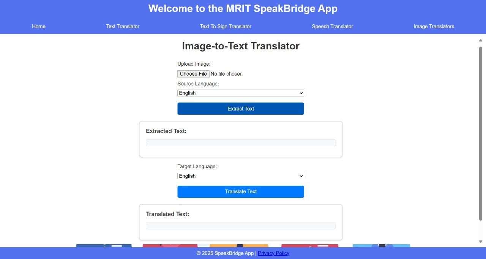

# 🌐 SpeakBridge: Multi-Modal Translator  

📌 **Overview**  
The **SpeakBridge Multi-Modal Translator** is a simple yet powerful web-based project that supports **text, speech, sign language (gesture-based), and image-based translation** in one platform.  
It helps break language barriers by providing accurate, real-time translations with a clean and user-friendly interface.  

---

## 🚀 Key Features  
✅ Translate text between multiple languages  
✅ Speech-to-Text and Text-to-Speech support  
✅ Image-to-Text translation using OCR  
✅ Text,Image-to-Sign language (gesture-based) recognition  
✅ Error handling for invalid inputs or failed API requests  
✅ Responsive design for desktop and mobile  

---

## 🛠️ Tech Stack  
- **Frontend / UI:** HTML, CSS, JavaScript  
- **APIs / Libraries:**  
  - Google Translate API (Text Translation)  
  - Google Speech-to-Text + Web Speech API  
  - Tesseract.js (OCR for image-to-text translation)  
- **Version Control:** Git + GitHub  

---

## 📖 How to Run  

You can view this project on GitHub here:  
🔗 **[Visit Repository](https://github.com/likithashreeh10/SpeakBridge-A-Multi-Modal-Translator)**  

To clone the project locally, use:  

```bash
git clone https://github.com/likithashreeh10/SpeakBridge-A-Multi-Modal-Translator.git


**🛠️ Steps to Run**

1.📥 Clone the repository using Git.

2.📂 Navigate into the project folder:

cd SpeakBridge-A-Multi-Modal-Translator

```

3.🌐 Open the index.html file in your browser.

4.⚙️ Ensure you have internet access for API calls.

5.🎙️ Allow microphone and camera permissions for speech and sign language modules.


## 🖼️ Screenshots

### 🔐 Login Page


### 🧾 Dashboard


### 🧾 Invoice / Billing Page


### 👥 Customer Management Page


### 🛒 Purchase Entry Page


---

## 👩‍💻 Author
**Likithashree H**  
🎓 Computer Science & Engineering Student  
🔗 [LinkedIn Profile](https://www.linkedin.com/in/likithashree-h-75a8b8308/)

.

